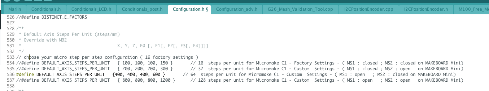
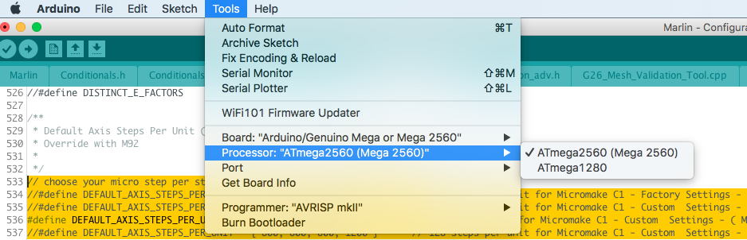
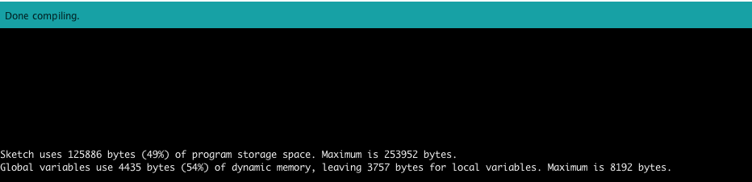

# marlin1.6-mcro-c1
firmware marlin 1.6 support micromake C1 
fixed. homing (z) slow  and ENDSTOP PIN  for mini micromake board 
Default  
    * - Enable Heat Bed 
    * - Power Supply 1 
    * - 64  steps per unit
    * - No auto bed level 


# Prerequisite 
* Mini micromaker board controller
* arduino 1.8x IDE

# choose your micro step per step configuration ( 64 default settings )

``` 
//#define DEFAULT_AXIS_STEPS_PER_UNIT   { 100, 100, 100, 150 }       // 16  steps per unit for Micromake C1 - Factory Settings - ( MS1 : closed ; MS2 : closed on MAKEBOARD Mini)
//#define DEFAULT_AXIS_STEPS_PER_UNIT   { 200, 200, 200, 300 }       // 32  steps per unit for Micromake C1 - Custom  Settings - ( MS1 : closed ; MS2 : open   on MAKEBOARD Mini)
#define DEFAULT_AXIS_STEPS_PER_UNIT   {400, 400, 400, 600 }       // 64  steps per unit for Micromake C1 - Custom  Settings - ( MS1 : open   ; MS2 : closed on MAKEBOARD Mini)
//#define DEFAULT_AXIS_STEPS_PER_UNIT   { 800, 800, 800, 1200 }      // 128 steps per unit for Micromake C1 - Custom  Settings - ( MS1 : open   ; MS2 : open   on MAKEBOARD Mini)

```

# How to Upload Firmware 

* Select Processer (ATmega2560) and prot (ex. com5 for window )

* Open marlin firmeware 



